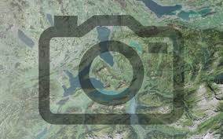

##  TUTO: injecter des métadonnées exifs dans des photos pour qu'elles soient géoreferencées.

Prérequis : 
Installer Visual code et Python.
Pour injecter les données de géoréférencement à des photos non géoréférencées, il faut : 
Créer une couche de point sur qgis avec les champs suivants : fid ; chemin ; x ; y
Pointer sur gis l’endroit où la photo a été prise et mettre dans le champ chemin, le chemin complet de la photo comme ci-dessous. Ne pas mettre des guillemets dans le chemin des photos.	
Mettre à jour les champs x et y dans la calculatrice de champ sur Qgis 

Une fois toutes les photos pointer, exporter la table attributaire en csv dans le même dossier où se trouve les photos. Le csv ne doit pas contenir la colonne géométrique
Enregistrer le script suivant dans Visual code avec l’extension python
Fichier ; 
Nouveau fichier texte ;
 Puis coller le script ci-dessous
Ensuite enregistrer le script dans le même dossier que les photos en allant dans Fichier – Enregistrer sous. Nommer votre fichier et choisir Python dans Type 
ATTENTION : les parties base_dir ; test_dir et csv_file du script souligné en vert doivent être modifier.
Base_dir : c’est le dossier mère/racine : dans mon exemple j’ai plusieurs sous-dossiers dont le dossier contenant mes photos dans mon dossier 06_prospection 
base_dir = r"C:\photos\06_Prospection"

Test_dir : c’est le nom du sous-dossier contenant mes photos dans 06_prospection ici c’est Fenioux
test_dir = os.path.join(base_dir, "Fenioux")

Csv_file : c’est le nom de mon csv se trouvant dans le même dossier que mes photos. N’oubliez pas l’extension.csv à la fin du nom de votre fichier dans le script
csv_file = os.path.join(test_dir, "fenioux.csv")  

import os
import pandas as pd

from pyproj import Transformer
import piexif
from PIL import Image

CODE: 

# ---- 1. Dossier de travail ----
base_dir = r"C:photos\06_Prospection"
test_dir = os.path.join(base_dir, "Fenioux")
csv_file = os.path.join(test_dir, "fenioux.csv")  # nom de ton CSV

# ---- 2. Charger le CSV UTF-8 avec points-virgules et nettoyage ----
df = pd.read_csv(csv_file, sep=";", encoding="utf-8-sig")  # point-virgule comme séparateur
df = df.rename(columns=lambda c: c.strip())  # supprime les espaces autour des noms de colonnes

# Vérification rapide des colonnes
print("Colonnes détectées dans le CSV :", df.columns.tolist())

# ---- 3. Convertir Lambert93 -> WGS84 ----
transformer = Transformer.from_crs("EPSG:2154", "EPSG:4326", always_xy=True)
df["lon"], df["lat"] = transformer.transform(df["x"].values, df["y"].values)

# ---- 4. Fonction pour convertir en format DMS rationnel ----
def deg_to_dms_rational(deg):
    d = int(abs(deg))
    m = int((abs(deg) - d) * 60)
    s = round((abs(deg) - d - m/60) * 3600 * 100)
    return ((d, 1), (m, 1), (s, 100))

# ---- 5. Nouveau dossier EXF (au même niveau que TEST) ----
output_dir = os.path.join(base_dir, "EXF")
os.makedirs(output_dir, exist_ok=True)

# ---- 6. Injection des coordonnées GPS dans chaque photo ----
for _, row in df.iterrows():
    # Nettoyage du chemin pour supprimer espaces et caractères invisibles
    chemin = row["chemin"].strip().replace("\u202a", "")
    
    lat, lon = row["lat"], row["lon"]

    lat_ref = "N" if lat >= 0 else "S"
    lon_ref = "E" if lon >= 0 else "W"

    gps_ifd = {
        piexif.GPSIFD.GPSLatitudeRef: lat_ref,
        piexif.GPSIFD.GPSLatitude: deg_to_dms_rational(lat),
        piexif.GPSIFD.GPSLongitudeRef: lon_ref,
        piexif.GPSIFD.GPSLongitude: deg_to_dms_rational(lon),
    }

    exif_dict = {"GPS": gps_ifd}
    exif_bytes = piexif.dump(exif_dict)

    try:
        im = Image.open(chemin)
        nom_fichier = os.path.basename(chemin)
        sortie = os.path.join(output_dir, nom_fichier)
        im.save(sortie, exif=exif_bytes)
        print(f"✅ Coordonnées ajoutées et sauvegardées dans {sortie}")
    except Exception as e:
        print(f"❌ Erreur pour {chemin} : {e}")

Une fois le script enregistrer, clic droit, ouvrir avec Python une fois le traitement terminer, un nouveau dossier nommer EXF contenant les photos avec des données EXIF sera créer au même niveau que les dossiers.

Importation et visualisation des photos géoréférencés sur Qgis
Sur qgis, vous avez la possibilité d’importer des photos sur l’interface et de les visualiser comme une couche. 